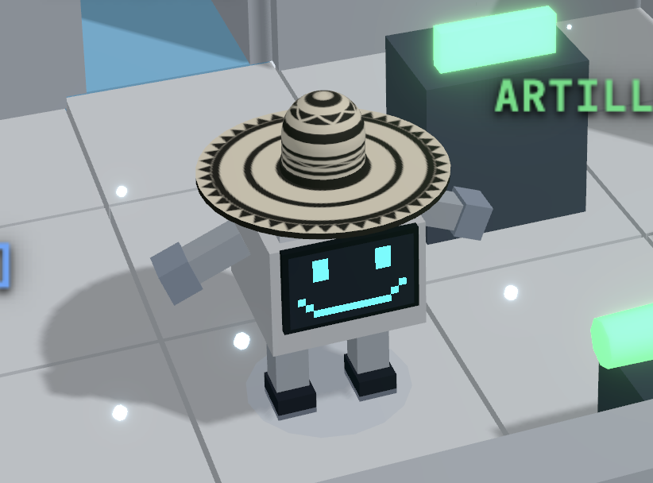

# Emergency Control — Planificador Autónomo de Operaciones Críticas

Agente de búsqueda que produce, mediante **UCS sobre Graph Search**, el plan de
menor costo que deja las estaciones críticas de la instalación en `ONLINE`. El
backend expone `POST /api/solve` y el frontend reproduce el plan resultante en
una simulación 3D.

<p align="center">
  
  <br>
  <em><strong>Costoñito</strong> — el robot de mantenimiento que ejecuta el plan.</em>
</p>

| Documento | Contenido |
|---|---|
| [`design.md`](design.md) | **Entregable 1** — estado, acciones, transición, meta, costo y estrategia de búsqueda |
| [`backend/src/`](backend/src/) | **Entregable 2** — el agente y el endpoint |
| [`backend/tests/`](backend/tests/) | **Entregable 3** — los cinco casos de validación |
| Este archivo | **Entregable 4** — cómo instalar, ejecutar e interpretar |
| [`../CONTRATO.md`](../CONTRATO.md) | Reglas del mundo y contrato cerrado del plan (parte del enunciado) |

```text
project/
├── backend/
│   ├── src/           # problem, state, actions, search, translate, main (FastAPI)
│   └── tests/         # validación de los 5 casos + tests de apoyo
├── frontend/          # React + TypeScript + Vite + React Three Fiber
├── scenarios/
│   └── scenario.json  # instancia demo — fuente de verdad
├── assets/            # imágenes del README
├── design.md
└── README.md
```

---

## Requisitos previos

| | Versión mínima | Probado con |
|---|---|---|
| Python | 3.9 | 3.9.6 |
| Node.js | 20 | 24.12.0 |
| npm | 9 | 11.6.2 |

No hace falta nada más: ni base de datos, ni Docker, ni variables de entorno.

> **Antes de empezar — el agente tarda.** Resolver la instancia demo con UCS
> toma **entre 30 y 40 segundos** en una máquina desocupada (más si el equipo
> está cargado). No es un cuelgue: la interfaz muestra un cronómetro mientras
> busca. Es el costo de una búsqueda óptima y exhaustiva, no un error.

Todos los comandos de abajo asumen que está situado en la **raíz del
repositorio** (la carpeta que contiene `CONTRATO.md` y `project/`).

---

## 1. Instalar dependencias

Necesita **dos terminales**, una para el backend y otra para el frontend.

### Terminal 1 — dependencias del backend

```bash
cd project/backend
python3 -m venv .venv
source .venv/bin/activate
pip install -r requirements.txt
```

En Windows, la tercera línea es `.\.venv\Scripts\activate` en lugar de `source ...`.

### Terminal 2 — dependencias del frontend

```bash
cd project/frontend
npm install
```

---

## 2. Iniciar el backend

En la **Terminal 1**, con el entorno virtual activado:

```bash
uvicorn main:app --app-dir src --port 8000
```

**Comprobar que funciona:** abra <http://127.0.0.1:8000/api/health>, debe
responder:

```json
{"status": "ok"}
```

Deje esta terminal abierta: el servidor tiene que seguir corriendo.

---

## 3. Iniciar el frontend

En la **Terminal 2**:

```bash
npm run dev
```

**Comprobar que funciona:** abra <http://localhost:5173>. Debe ver la
instalación en 3D con el robot en la zona Z1.

> Si el puerto 5173 estuviera ocupado, Vite elegirá otro (5174, 5175…) y lo
> anunciará en la terminal. Use el que imprima.

Vite redirige `/api/*` al backend del puerto 8000, así que **ambas terminales
deben estar corriendo a la vez**. Si el backend no está levantado, la interfaz
mostrará `API ERROR` en el registro de ejecución.

---

## 4. Ejecutar el agente

Pulse el botón **EXECUTE PLAN** (abajo a la izquierda).

Ocurre lo siguiente:

1. El frontend envía `scenarios/scenario.json` a `POST /api/solve`.
2. El backend construye el problema y ejecuta UCS. **Aquí están los ~35 s.**
   Durante la espera aparece un panel con un cronómetro y Costoñito pone cara de
   estar pensando.
3. Cuando llega el plan, Costoñito lo ejecuta paso a paso en la simulación.

Los controles del pie de pantalla:

| Control | Qué hace |
|---|---|
| **EXECUTE PLAN** | Pide el plan y lo reproduce. Se deshabilita mientras trabaja |
| **RESET** | Vuelve al estado inicial. Durante la búsqueda, **cancela** la petición |
| **SPEED** | Velocidad de reproducción (0.5× – 3×). No afecta a la búsqueda |

El agente también se puede ejecutar sin interfaz alguna: vea la sección 5.

---

## 5. Probar una misión

### 5.1. La misión demo, desde la interfaz

Pulse **EXECUTE PLAN**. Al terminar debe ver las tres estaciones en `ONLINE`,
a Costoñito celebrando y el resumen: **35 pasos, costo 80**.

### 5.2. La misma misión, desde la terminal

Sin abrir el navegador. Abra una **tercera terminal en la raíz del repositorio**
(las otras dos están ocupadas por los servidores) y, con el backend corriendo:

```bash
curl -s -X POST http://127.0.0.1:8000/api/solve -H 'Content-Type: application/json' -d @project/scenarios/scenario.json
```

Tarda los mismos ~35 s y devuelve el JSON que se describe en la sección 6.

### 5.3. Otra instancia cualquiera

El endpoint acepta **cualquier escenario** que cumpla el esquema de
[`../CONTRATO.md`](../CONTRATO.md); no hay nada codificado a mano para la
instancia demo. Para probar posiciones, costos, recursos o metas distintas:

```bash
curl -s -X POST http://127.0.0.1:8000/api/solve -H 'Content-Type: application/json' -d @ruta/a/su-escenario.json
```

Para verlo además en la simulación 3D, edite `project/scenarios/scenario.json`
directamente (el frontend lo importa desde ahí y recarga solo). Tenga en cuenta
que la escena 3D se dibuja a partir del bloque `layout` del JSON: si añade zonas
nuevas, también hay que describirlas ahí. **El agente ignora `layout` por
completo**, así que para evaluarlo basta con `curl`.

### 5.4. Una misión sin solución

El agente debe responder `FAILURE`, no colgarse. Se puede comprobar
directamente, desde la raíz y **con el entorno virtual activado**:

```bash
cd project/backend && python tests/test_case4_failure.py
```

Cubre cuatro maneras de que una misión sea imposible (falta una llave
imprescindible, falta un material, una estación inalcanzable, batería
insuficiente) y comprueba que en todas termina y devuelve `FAILURE`.

---

## 6. Interpretar el resultado

### 6.1. La respuesta de `/api/solve`

```json
{
  "solution_found": true,
  "total_cost": 80,
  "steps": [
    { "op": "PICKUP",   "item": "KEY1", "cost": 1 },
    { "op": "INTERACT", "target": "DOOR1", "action": "OPEN_DOOR", "cost": 2 },
    { "op": "MOVE",     "from": "Z1", "to": "Z2", "cost": 4 }
  ],
  "message": "Plan generado por UCS (Graph Search con dominancia de batería)."
}
```

| Campo | Significado |
|---|---|
| `solution_found` | `true` si existe plan; `false` es el `FAILURE` del enunciado |
| `total_cost` | Suma de los costos de los pasos — **la métrica que UCS minimiza** |
| `steps` | El plan, ya traducido al contrato cerrado |
| `message` | Descripción legible (qué estrategia lo produjo, o por qué falló) |

Cuando no hay plan:

```json
{
  "solution_found": false,
  "total_cost": 0,
  "steps": [],
  "message": "No existe un plan válido para esta misión (FAILURE)."
}
```

**Dos respuestas negativas distintas.** Ambas traen `solution_found: false`,
pero no significan lo mismo — el `message` las distingue:

| `message` empieza por… | Qué significa |
|---|---|
| `No existe un plan válido…` | El `FAILURE` del enunciado, **demostrado**: la búsqueda agotó OPEN sin encontrar meta. No hay plan. |
| `Búsqueda detenida por presupuesto…` | La búsqueda se cortó por su tope de seguridad (15 M de estados o 180 s). **No** afirma que la misión sea imposible: no se pudo determinar. |

Los topes existen para que ninguna instancia deje la simulación colgada. Están
calibrados con margen sobre la instancia más cara medida, de modo que una misión
con solución no debería toparse con ellos; ver `design.md` § *Validación*.

### 6.2. Cómo se lee un paso

El plan usa únicamente las cuatro operaciones visuales del contrato:

| `op` | Campos | Significado |
|---|---|---|
| `MOVE` | `from`, `to` | Recorre el corredor entre dos zonas. El costo es el del corredor |
| `PICKUP` | `item` | Recoge una llave, herramienta o unidad de material de la zona actual |
| `DROP` | `item` | Deja un objeto en la zona actual (solo cuando la carga bloquea algo) |
| `INTERACT` | `target`, `action` | Opera sobre un elemento del entorno |

Dentro de `INTERACT`, el campo `action` es uno de:
`OPEN_DOOR` · `REPAIR` (lleva además `consumes` con el material gastado) ·
`ACTIVATE` · `RECHARGE`.

> Las acciones **internas** del agente no son estas: el agente razona con su
> propio modelo y lo traduce al contrato en
> [`backend/src/translate.py`](backend/src/translate.py). La capa visual no
> determina la lógica de la IA. Vea la sección *Contrato visual vs agente*.

### 6.3. Qué muestra la interfaz

| Zona de la pantalla | Qué indica |
|---|---|
| **POWER CORE** (izq.) | Batería actual sobre el máximo. Baja con cada acción y se restaura con `RECHARGE` |
| **PAYLOAD** (izq.) | Objetos cargados, sobre la capacidad máxima. Explica los `DROP` |
| **ENERGY COST** (der.) | Costo acumulado de lo ejecutado hasta ahora. Al final coincide con `total_cost` |
| **EXECUTION LOG** (der.) | Un renglón por paso, con el costo y la batería restante. En rojo, los errores |
| **STEP n/m** (der.) | Progreso dentro del plan |
| **ZONE** (abajo dcha.) | Zona en la que está el robot |
| Etiquetas 3D | Estado en vivo de puertas (`OPEN`/`CLOSED`), paneles (`OK`/`DAMAGED`) y estaciones (`ONLINE`/`OFFLINE`) |
| Color del suelo | Costo del corredor: cada costo tiene un color distinto (leyenda en el panel izquierdo) |

**El resultado final** aparece como un cartel de misión completada con el número
de pasos, la energía gastada y el costo del plan. Si algo fallara, el registro
lo marcaría en rojo y el robot lo anunciaría.

Importante: el frontend **no confía en el plan**, lo vuelve a simular paso a
paso aplicando las reglas del mundo. Si el plan violara una precondición
(batería insuficiente, puerta cerrada, material que no se lleva), la ejecución
se detendría con un error en el registro. Que la simulación llegue al final es,
por tanto, una comprobación independiente de que el plan es legal.

---

## Validación — Entregable 3

Los cinco casos que exige el enunciado están en `backend/tests/`. Se ejecutan
todos con un solo comando, sin dependencias más allá de `requirements.txt`.
**Necesita el entorno virtual activado** (los tests del Caso 4 comprueban también
la respuesta del endpoint, y para eso importan FastAPI):

```bash
cd project/backend
source .venv/bin/activate
python tests/run_all.py
```

Salida esperada (entre 30 y 60 s según la carga de la máquina; el grueso son
las búsquedas sobre el escenario real):

```text
CASO 1 — Estados equivalentes................. 4/4 OK
CASO 2 — Información relevante................ 5/5 OK
CASO 3 — Costos ≠ número de acciones.......... 4/4 OK
CASO 4 — Sin solución (FAILURE)............... 8/8 OK
CASO 5 — Rutas alternativas................... 6/6 OK
Soporte — Política PICKUP/DROP................ 4/4 OK
Soporte — El agente resuelve la demo.......... 4/4 OK
Base — Plan artesanal de referencia........... 3/3 OK
```

| Caso del enunciado | Archivo |
|---|---|
| 1 — Estados equivalentes | `tests/test_case1_equivalent_states.py` |
| 2 — Información relevante | `tests/test_case2_relevant_info.py` |
| 3 — Costos diferentes | `tests/test_case3_cost_vs_steps.py` |
| 4 — Sin solución | `tests/test_case4_failure.py` |
| 5 — Rutas alternativas | `tests/test_case5_alternative_routes.py` |

Cada uno se puede correr por separado, por ejemplo
`python tests/test_case3_cost_vs_steps.py`. Qué demuestra cada caso y contra qué
afirmación del diseño se contrasta está en
[`design.md` § Validación](design.md#validación).

---

## Si algo no funciona

| Síntoma | Causa y solución |
|---|---|
| `API ERROR` en el registro | El backend no está corriendo. Revise la Terminal 1 y <http://127.0.0.1:8000/api/health> |
| La búsqueda tarda más de un minuto | Normal si el equipo está cargado: el agente es un proceso de un solo hilo. El cronómetro sigue avanzando |
| El navegador no abre en 5173 | Vite tomó otro puerto porque el 5173 estaba ocupado; use el que imprimió la terminal |
| `command not found: uvicorn` | El entorno virtual no está activado. Repita `source .venv/bin/activate` |
| `ModuleNotFoundError: No module named 'fastapi'` al correr los tests | Lo mismo: active el entorno virtual antes de `python tests/run_all.py` |
| `npm ERR! ERESOLVE` | Ejecute `npm install` en `project/frontend`, no en otra carpeta. Las versiones están fijadas para ser compatibles entre sí |

---

## Contrato visual vs agente

La versión oficial y completa de este contrato (esquema JSON, acciones de
`INTERACT`, reglas del mundo y costos) está en
[`../CONTRATO.md`](../CONTRATO.md), que forma parte del enunciado.

El enunciado fija **4 operaciones visuales** que el frontend entiende:

```text
MOVE | PICKUP | DROP | INTERACT
```

`REPAIR`, `ACTIVATE`, `OPEN_DOOR` y `RECHARGE` **no son ops del plan**: son el
campo `action` dentro de un paso `INTERACT`.

```json
{ "op": "INTERACT", "target": "PANEL_A", "action": "REPAIR", "consumes": "FUSE", "cost": 2 }
```

- **El agente** modela sus propias acciones internas y las **traduce** a las
  cuatro operaciones en [`backend/src/translate.py`](backend/src/translate.py).
- **El frontend** solo ejecuta esas cuatro. El registro muestra
  `INTERACT REPAIR ...` para dejar visibles el `op` y el `action`.

La capa visual no define la IA: solo anima el plan ya traducido.
